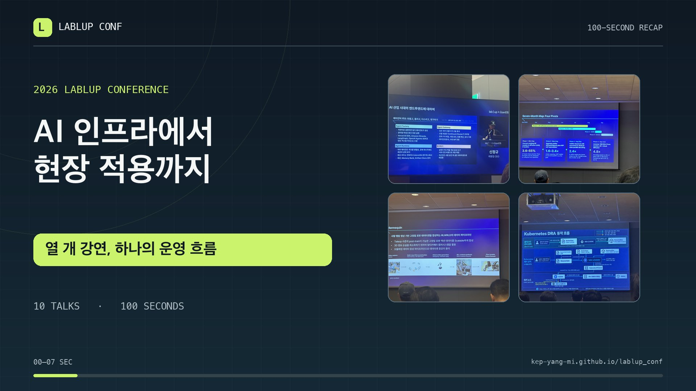

# Lablup 현장 노트

2026년 9월 29일 Lablup 관련 강연 10개를 정리한 정적 웹페이지입니다. Plaud 녹음은 9개이며, 13시 녹음에 포함된 두 강연을 분리했습니다. [GitHub Pages에서 현장 노트 보기](https://kep-yang-mi.github.io/lablup_conf/)

## 100초 요약 영상

[▶ 영상 재생](https://kep-yang-mi.github.io/lablup_conf/#video) · [MP4 파일](assets/lablup_conf_100s.mp4) · [한국어 자막](assets/lablup_conf_100s.vtt)

강연 순서대로 현장 사진과 핵심 내용을 엮었습니다. 한국어 합성 내레이션과 자막이 포함되어 있습니다.

## 구성

- 100초 요약 영상: `assets/lablup_conf_100s.mp4` (한국어 합성 내레이션·자막 포함)
- 웹 자막: `assets/lablup_conf_100s.vtt`

- index.html: 페이지 구조와 메타데이터
- sessions.js: 세션별 요약과 핵심 내용
- app.js: 주제 필터 및 상세 펼치기
- styles.css: 반응형 스타일
- assets/: 세션별 현장 사진 16장

Plaud에 보관된 음성 전사와 자동 요약, 현장 사진을 토대로 다시 작성했습니다. 원본 녹음, 전체 전사, 원본 사진과 동영상은 공개 저장소에 포함하지 않습니다. 공개 사진은 웹용으로 크기를 줄이고 원본 메타데이터를 제거했습니다. 자동 전사의 오류 가능성이 있는 수치와 고유명사는 공개 본문에서 제외했습니다.

## 현장 메모 보강

행사에서 직접 적은 메모를 다시 받아 키노트, 추론 최적화, 디퓨전 LLM, AI 팩토리, 컨티넘, GPU 운영의 6개 세션 상세 영역에 반영했습니다. 메모의 기술 용어는 Plaud 요약과 대조해 정리했고, 근거가 불명확한 수치와 철자가 확인되지 않은 이름·인수 소식은 단정적으로 게시하지 않았습니다.

## 로컬 미리보기

이 폴더에서 python3 -m http.server 8766 을 실행한 뒤 http://localhost:8766 을 엽니다.

## 사진

세션당 대표 사진 한 장을 카드에 표시하고 추가 사진은 상세 영역에 배치했습니다. 이미지를 클릭하면 큰 크기로 볼 수 있습니다.

원본 이미지의 생성 순서는 강연 순서와 같습니다. 촬영 시간과 슬라이드 내용으로 확인한 대응 관계는 아래와 같습니다. 전체 원본 중 설명에 도움이 되는 16장만 웹용으로 선별했습니다.

| 세션 | 원본 파일 번호 |
| --- | --- |
| AI 산업 시대의 엔드투엔드에 대하여 | IMG_5300–5304 |
| AI 병목을 해결하는 인퍼런스 최적화 | IMG_5305–5312 |
| LLM Interence 가속 트렌드와 Diffusion LLM 개발기 | IMG_5313 |
| AI Factory 성공 5가지 핵심 원칙 | IMG_5315–5317 |
| UI 포함 PR, AI 믿고 그냥 Merge 할까요? | IMG_5318 |
| Furiosa-LLM : High-Performance LLM serving for RNGD | IMG_5319–5326 |
| 기업환경에서 AI Agent부터 ML까지 하나의 워크플로우로 | IMG_5328–5334 |
| Maanequin : 인간 시연을 로봇 데이터로 바꾸는 RLWRLD의 데이터 파이프라인 | IMG_5335.MOV, IMG_5336.HEIC |
| 그래서 토큰은 누가 관리하나요? | IMG_5337–5346 |
| 쿠버네티스에서의 GPU 활용 방법의 변화 | IMG_5347–5355 |

IMG_5314는 13시 녹음 말미의 온프레미스 운영 발표 장면으로, 받은 강연 제목 목록에 없어 대표 사진에서 제외했습니다. IMG_5327은 세션 사이에 촬영한 행사장 사진입니다.
